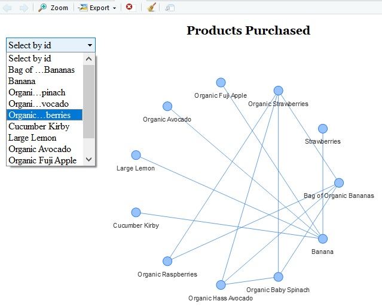
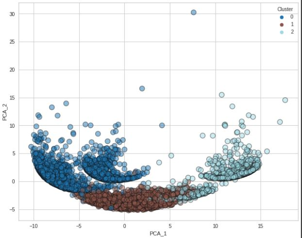

# Unsupervised Machine Learning Repository

## I. Repository Overview
- This repository contains different sub-repositories covering different *Unsupervised Machine Learning* techniques such as  `Association Rules`, `K-Means` clustering on different datasets.
- Currently 2 folders are available in this repository:
  1. `association_rules`
  2. `clustering_kmeans`
  
## II. Folder details
1. **`association_rules`**
   - **Market Basket Analysis using Association Rules** : This sub-repository covers `Market Basket Analysis` using `Association Rules` on grocery data :[The Instacart Online Grocery Shopping Dataset 2017](https://www.instacart.com/datasets/grocery-shopping-2017), to find patterns such as people who bought grocery item *X* tend to buy grocery item *Y* as well. 
     

2. **`clustering_kmeans`**
   - This sub-repository covers *customer-segmentation analysis* using `K-means` on [Credit Card Dataset for Clustering](https://www.kaggle.com/datasets/arjunbhasin2013/ccdata.html) dataset taken from Kaggle website. 
      
