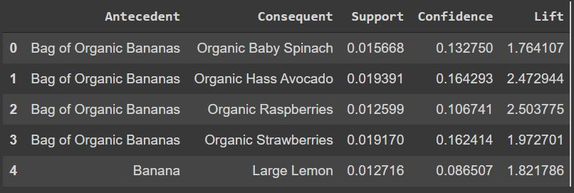
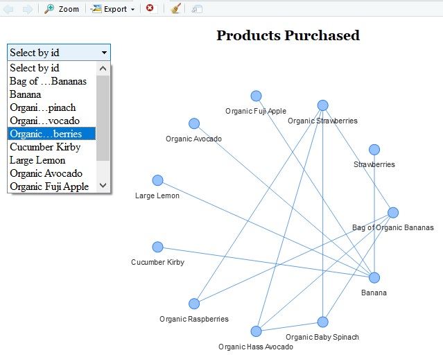

## **Market Basket Analysis using Association Rules**

- This sub-repository covers `Market Basket Analysis` using `Association Rules` on grocery data :[The Instacart Online Grocery Shopping Dataset 2017](https://www.instacart.com/datasets/grocery-shopping-2017)
- The analysis is covered in the notebook `a_rules.ipynb`. The output of this file generates `rules_results.csv`, which contains pairs of `Antecedent`-`Consequent` food items under certain `Support`,`Confidence`, and `Lift` conditions.   
    
- In simpler terms, Antecedent-Consequent pair means that people who bought Antecedent food item tend to buy Consequent food item more often than some random chance. Thus, a certain association exists between these food items. In different business settings, such anlaysis can help in identifying multiple cross-selling and up-selling opportunites.
- R file `rules_visuals.R` takes the output file `rules_results.csv`, generated from `a_rules.ipynb` to generate an interactive network graph that shows different pairs of food items that are often bought together.  
  
