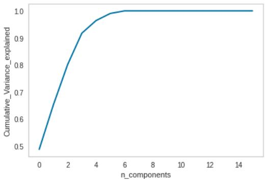
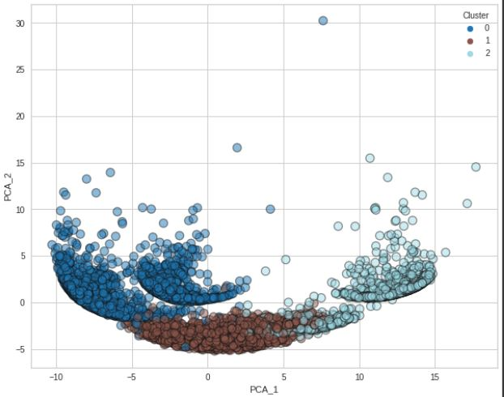
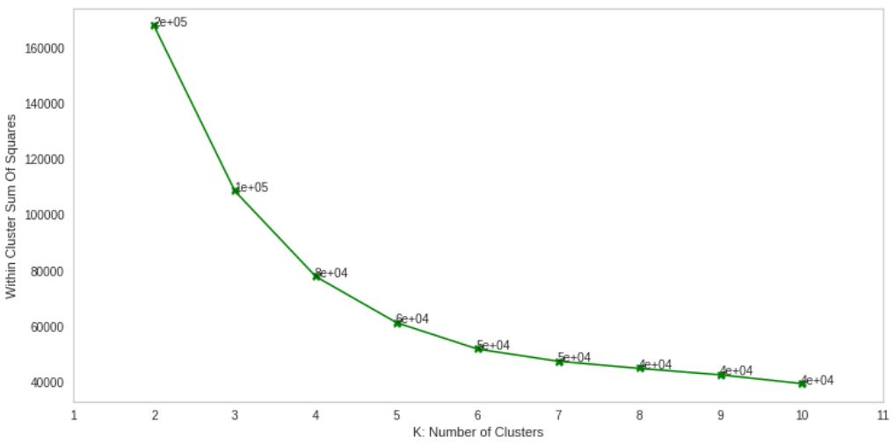
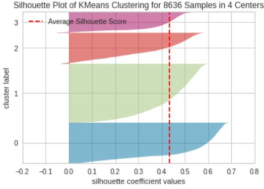

## **Credit Cards Customers segmentation using K-means**

- This repository covers customer-segmentation analysis `K-means` on [Credit Card Dataset for Clustering](https://www.kaggle.com/datasets/arjunbhasin2013/ccdata.html) dataset from Kaggle website has been used for model development and analysis.
- Different machine learning techniques and analysis such as : **PCA, Silhoutte plots using K-means, Elbow plots using K-means etc** were applied to develop right number of clusters and relevant business strategy. 
     
   
